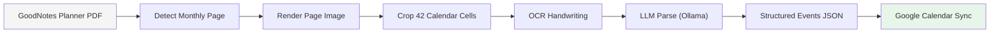

# 📅 GoodNotes Planner ↔ Google Calendar Sync

Synchronize handwritten monthly planner entries from a GoodNotes PDF with Google Calendar.

This project extracts calendar cells from a fixed-layout monthly planner PDF, performs OCR on handwritten text, uses a local LLM (Ollama) to convert notes into structured events, and syncs them to Google Calendar with deduplication.

---

# ✨ Features

- Detect monthly calendar pages inside mixed-layout PDFs
- Crop monthly grid into 42 day cells
- OCR handwritten text (EasyOCR, Windows-friendly)
- LLM parsing → structured calendar events
- Google Calendar sync with stable deduplication
- Re-runnable (safe updates, no duplicates)

---

# 🧠 How It Works

Pipeline:



Architecture:

```
app/
  pdf/        # PDF detection, render, crop
  ocr/        # OCR engines
  llm/        # Ollama parser
  core/       # calendar math, filters
  calendar/   # Google provider
  pipelines/  # end-to-end flows
```

---

# 📦 Installation

## 1️⃣ Clone

```bash
git clone https://github.com/YOUR_USERNAME/sync-goodnotes-calendar.git
cd sync-goodnotes-calendar
```

## 2️⃣ Create environment

Windows:

```bash
python -m venv .venv
.venv\Scripts\activate
```

## 3️⃣ Install dependencies

```bash
pip install -r requirements.txt
```

---

# 🗂 Project Setup

Place your planner PDF:

```
input/
  2026.pdf
```

Create secrets folder:

```
secrets/
  google_credentials.json
```

---

# 🔐 Google Calendar Setup

1. Go to Google Cloud Console
2. Enable **Google Calendar API**
3. Create OAuth Client ID (Desktop)
4. Download JSON → `secrets/google_credentials.json`

First run will open browser to authorize.

---

# 🤖 Ollama Setup

Install Ollama:

https://ollama.com/

Pull model:

```bash
ollama pull llama3.1
```

Start service (if not auto):

```bash
ollama serve
```

---

# ▶️ Usage

## 1️⃣ Detect monthly pages

```bash
python -m app.main detect --pdf input/2026.pdf
```

## 2️⃣ Crop planner grid

```bash
python -m app.main crop --pdf input/2026.pdf --limit 1
```

Output:

```
out/pages/
out/cells/page_XXX/
```

## 3️⃣ OCR cells

```bash
python -m app.ocr.runner
```

Output:

```
out/ocr/page_XXX.json
```

## 4️⃣ Extract events + Sync to Google

```bash
python -m app.pipelines.import_one_page
```

---

# 🧾 Example Extracted Event

```json
{
  "title": "Dentist",
  "start": "2026-02-10T10:00",
  "end": null,
  "all_day": false,
  "notes": null,
  "confidence": 0.82
}
```

---

# 🔁 Deduplication Strategy

Each planner cell generates a stable UID:

```
date + title + time + cell_position
```

Mapped to Google `iCalUID`.

Re-running sync:

- existing → update
- new → insert
- unchanged → skip

Safe to run multiple times.

---

# ⚙️ Configuration

Edit `app/config.py`:

```python
YEAR = 2026
TZ = "America/Vancouver"
OLLAMA_MODEL = "llama3.1"
```

---

# 📁 Ignored Files

Not tracked:

- OCR output (`out/`)
- Planner PDFs (`input/` optional)
- Google tokens (`secrets/`)
- Virtual env (`.venv/`)

---

# 🧪 Status

Current:

- Monthly detection ✅
- Grid crop ✅
- OCR ✅
- LLM parse ✅
- Google sync ✅

Planned:

- Reverse sync (Google → PDF)
- iCloud Calendar provider
- Auto watch mode
- Multi-month batch sync

---

# 💡 Design Notes

Why OCR + LLM?

Handwritten planner text is inconsistent:

```
7 gym
10 dentist
mom call
```

LLM normalizes to structured events.

Why fixed grid ratio?

Planner layout is constant → faster + robust vs vision detection.

---

# 👤 Author

Ella Lee
Backend / AI / Automation Engineer

---

# 📄 License

MIT
